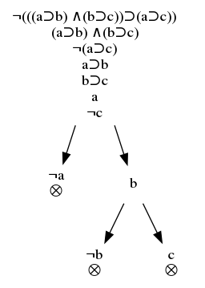

- [TreeProof with Ocaml](#orgb3f0fa7)
  - [Option](#orgaba2796)
  - [Help](#orgdf1c130)
  - [Compilation](#orgd451ddd)
  - [Exemple](#orgc1c6a5c)
  - [Démonstration](#org07ee42a)


<a id="orgb3f0fa7"></a>

# TreeProof with Ocaml

> In proof theory, [the semantic tableaux](https://en.wikipedia.org/wiki/Method_of_analytic_tableaux) (truth tree, *methode des arbres* in french) is a decision procedure. An analytic tableau is a tree structure computed for a logical formula, having at each node a subformula of the original formula to be proved or refuted. Computation constructs this tree and uses it to prove or refute the whole formula.

Forest is a prover, wrote in Ocaml.

It produces the graphviz dot file of the proof and the tree of formula (also in dot).


<a id="orgaba2796"></a>

## Option

| Command | Description                                         | File's name |
|------- |--------------------------------------------------- |----------- |
| -t      | allow the generation of the tree formula dot's file | formula.dot |
| -g      | allow the generation of the proof dot's file        | proof.dot   |
| -h      | show a description of the different options         |             |


<a id="orgdf1c130"></a>

## Help

```
négation    : ! ~ -
conjonction : & . 
disjonction : v | +
conditionel : > -> =>
équivalence : = <=> 
```

(the programme can take in charge variable<sup><a id="fnr.1" class="footref" href="#fn.1">1</a></sup> longer than one character, but be careful of the parentheses)


<a id="orgd451ddd"></a>

## Compilation

```
ocamlc str.cma forest.ml -o forest
```


<a id="orgc1c6a5c"></a>

## Exemple




<a id="org07ee42a"></a>

## Démonstration

<https://marin.elie.org/tree/>

## Footnotes

<sup><a id="fn.1" class="footnum" href="#fnr.1">1</a></sup> v is an operator&#x2026; have fun